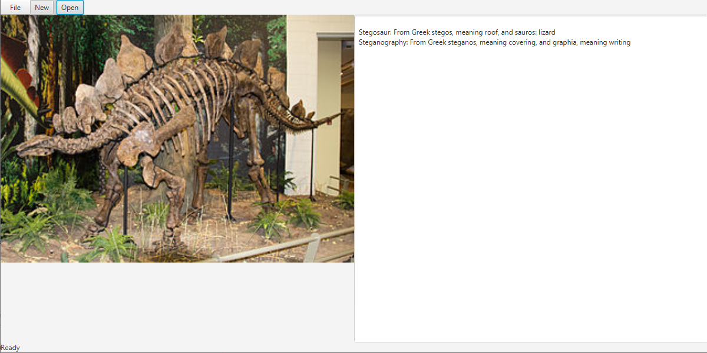

# Steganography


[](https://github.com/Abruuham/steganography)

This project was written in Java in order to practice steganography and learn more about encryption including:

  - Decrypting messages inside of an image that were encrypted with this project
  - Encrypting messages to later be decyrpted (still working on this)





### Tech

This project is solely using the Java programming language and Netbeans for my IDE but you can use any that you'd like. All of the necessary Java files and Netbeans can be downloaded form here:

* [Java]
* [Netbeans]


### Try it out

All you need to run this project on your computer is git and an IDE of your choice that can run Java applications. I am using Netbeans to write this which can be donwloaded here <https://www.java.com/en/download/>.

To clone this project, what I did first was create a folder on my machine where I wanted to download the project to. Then, copy the directoy of the folder that you just created. 
Open a terminal and "cd" into the folder. Then follow the steps below:

```sh
$ git init
$ git pull https://github.com/Abruuham/steganography.git
```

And that is it!

If you dont want to use git, then just click on the "clone or download" button and download the .zip file to your computer.


### Todos

 - Finish writing the Ecryption methods to be able to hide messages in any image
 - Expand the project to allow for different and more secure encryption methods
 - Create a GUI in java to make the application more user friendly

License
----

MIT

**Just for Fun!**

Feel free to follow me on [instagram] or on my [linked in]! I'm still and always will be learning and practicing new ways of programming so if you have any suggestions, please message me and help me learn something new!

**Programming, Hell Yeah!**


   [git-repo-url]: <https://github.com/Abruuham/steganography.git>
   [linked in]: <https://www.linkedin.com/in/abraham-calvillo/>
   [instagram]: <https://www.instagram.com/abruuh_ham>
   [netbeans]: <https://netbeans.org/>
   [java]: <https://www.java.com/en/download/>
